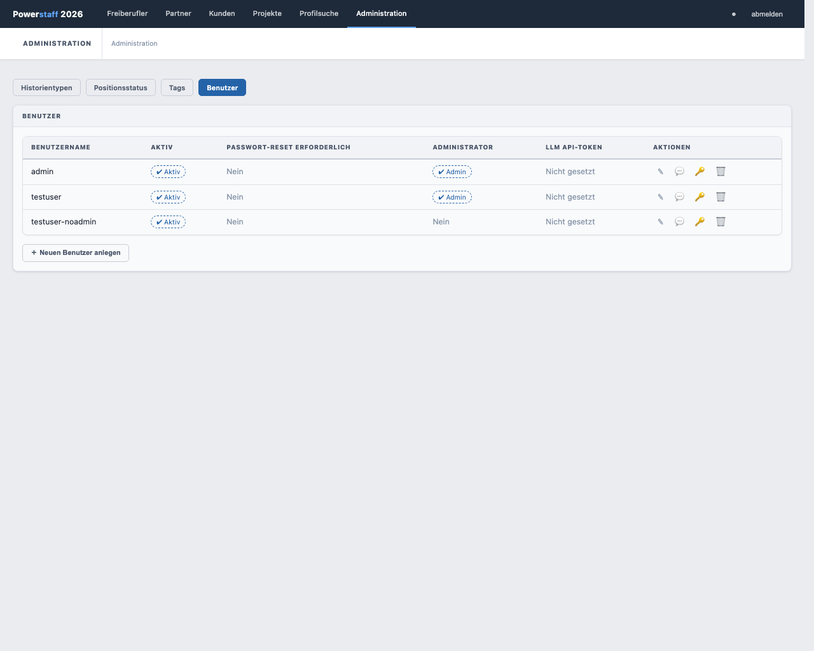

# Benutzerverwaltung

> **Hinweis:** Die vollständige Benutzerverwaltung (Anlegen, Bearbeiten) ist nur für **Administratoren** zugänglich.
> Nicht-Admins sehen nur ihre eigenen Profildaten.

Klicken Sie in der Navigation auf **Administration** → Tab **Benutzer**.

---

## Benutzertabelle

| Spalte | Beschreibung |
|--------|-------------|
| **Benutzername** | Eindeutiger Login-Name |
| **Aktiv** | ✔ Aktiv / ✖ Inaktiv – Inaktive Benutzer können sich nicht einloggen |
| **Passwort-Reset erforderlich** | Ja: Benutzer muss Passwort beim nächsten Login ändern |
| **Administrator** | ✔ Admin / Nein – Admins haben Zugriff auf alle Stammdaten und Benutzerverwaltung |
| **LLM API-Token** | ✔ Gesetzt / Nicht gesetzt – Nur für Admins sichtbar |
| **Aktionen** | Bearbeiten / Passwort ändern |

---

## Neuen Benutzer anlegen

> Nur für Administratoren

1. Klicken Sie auf **＋ Neu**
2. Tragen Sie **Benutzername** ein
3. Setzen Sie ggf. **Administrator** (Checkbox)
4. Klicken Sie auf **Speichern**

Der Benutzer muss beim ersten Login ein Passwort setzen (**Passwort-Reset erforderlich** = Ja).

---

## Benutzer bearbeiten

> Nur für Administratoren

Klicken Sie auf **✎** neben dem Benutzer:
- **Aktiv**: Benutzer aktivieren oder deaktivieren
- **Passwort-Reset erforderlich**: Benutzer muss beim nächsten Login Passwort ändern
- **Administrator**: Admin-Rechte vergeben oder entziehen

---

## Eigenes Passwort ändern

Jeder Benutzer kann sein eigenes Passwort über die Aktions-Schaltfläche ändern.
Klicken Sie auf das Schlüssel-Symbol in der Zeile des eigenen Benutzers.
