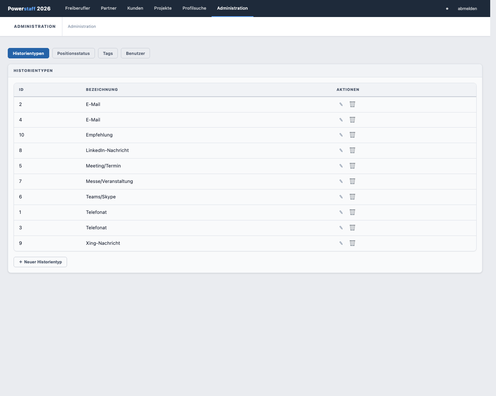
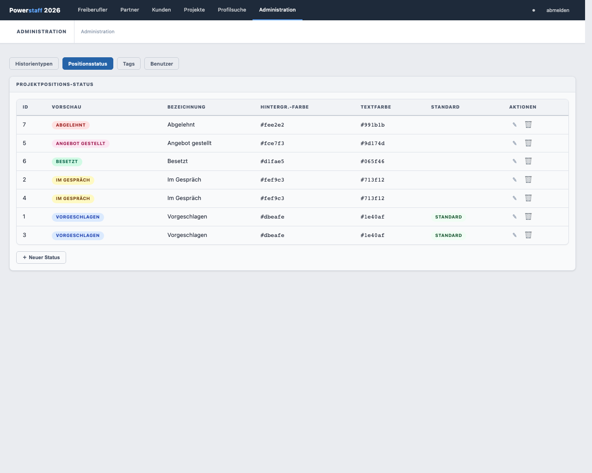
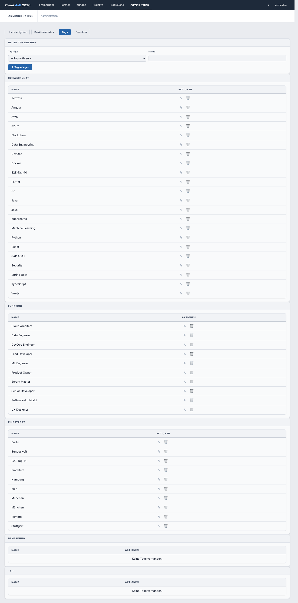

# Stammdaten verwalten

> **Hinweis:** Der Stammdaten-Bereich ist nur für **Administratoren** zugänglich.

Klicken Sie in der Navigation auf **Administration**. Der Bereich umfasst vier Unter-Bereiche:
**Historientypen · Positionsstatus · Tags · Benutzer**

---

## Historientypen

Historientypen klassifizieren Einträge in der Kontakthistorie (z. B. *Telefonat*, *E-Mail*, *Meeting*).

### Neuen Historientyp anlegen

1. Klicken Sie auf **＋ Neu**
2. Tragen Sie eine **Bezeichnung** ein
3. Klicken Sie auf **Speichern**

### Historientyp bearbeiten

Klicken Sie auf das Stift-Symbol **✎** neben dem Eintrag.

### Historientyp löschen

Klicken Sie auf das Papierkorb-Symbol **🗑** neben dem Eintrag.

> **Hinweis:** Historientypen, die bereits in Kontakthistorie-Einträgen verwendet werden,
> können nicht gelöscht werden.

---

## Positionsstatus

Positionsstatus definiert die möglichen Zustände einer Projektposition (z. B. *Vorgeschlagen*,
*Im Gespräch*, *Besetzt*). Jeder Status hat eine konfigurierbare Hintergrund- und Textfarbe
für den farbigen Badge in der Positionstabelle.

### Tabellenspalten

| Spalte | Beschreibung |
|--------|-------------|
| **ID** | Interne ID |
| **Vorschau** | Farbiger Badge wie er in der Positionstabelle erscheint |
| **Bezeichnung** | Name des Status |
| **Hintergr.-Farbe** | Hintergrundfarbe des Badges (CSS-Farbwert, z. B. `#22c55e`) |
| **Textfarbe** | Textfarbe des Badges |
| **Standard** | Wird dieser Status bei neuen Zuordnungen vorausgewählt? |

### Status anlegen, bearbeiten, löschen

Analog zu Historientypen: **＋ Neu**, **✎** (Bearbeiten), **🗑** (Löschen).

---

## Tags

Tags sind Schlagworte, die Freiberuflern zugeordnet werden können (z. B. Skills, Technologien).
Tags sind in Kategorien (Tag-Typen) organisiert.

### Tag anlegen, bearbeiten, löschen

Analog zu Historientypen: **＋ Neu**, **✎** (Bearbeiten), **🗑** (Löschen).
