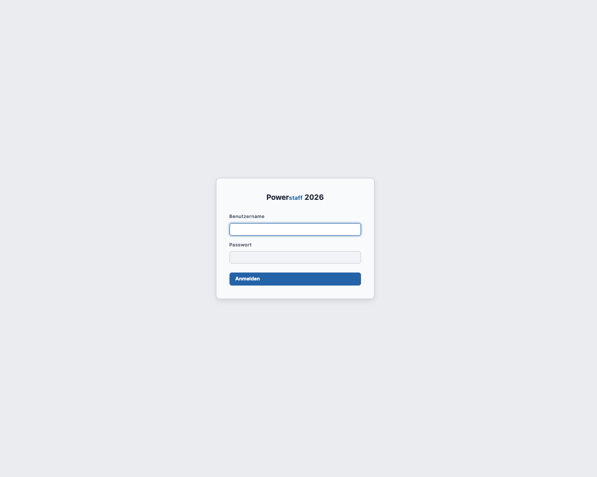

# Erste Schritte

## Login

Öffnen Sie die Anwendung im Browser. Sie sehen die Login-Seite von **Powerstaff 2026**.

Geben Sie Ihren **Benutzernamen** und Ihr **Passwort** ein und klicken Sie auf **Anmelden**.

Bei falschen Zugangsdaten erscheint die Meldung: *Ungültiger Benutzername oder Passwort.*

---

## Die Oberfläche

Nach dem Login sehen Sie die Hauptoberfläche mit zwei zentralen Bereichen:

### Navigation (obere Leiste)

Die obere Navigationsleiste enthält:

| Element | Funktion |
|---------|---------|
| **Freiberufler** | Zur Freiberuflerverwaltung |
| **Partner** | Zur Partnerverwaltung |
| **Kunden** | Zur Kundenverwaltung |
| **Projekte** | Zur Projektverwaltung |
| **Profilsuche** | KI-Chat und klassische Filtersuche |
| **Administration** | Stammdaten, Benutzer, API-Tokens (nur Admins) |
| **◐** | Hell-/Dunkel-Modus wechseln |
| **[Benutzername] abmelden** | Ausloggen |

### Toolbar (unter der Navigation)

Jedes Formular hat eine Toolbar mit folgenden Funktionen:

| Schaltfläche | Funktion |
|-------------|---------|
| ⏮ | Zum ersten Datensatz springen |
| ◀ | Zum vorherigen Datensatz |
| [ID-Feld] | ID direkt eingeben und mit Enter aufrufen |
| ▶ | Zum nächsten Datensatz |
| ⏭ | Zum letzten Datensatz |
| 🔍 **Suchen** | QBE-Suche mit den aktuellen Formularfeldern starten |
| ＋ **Neu** | Leeres Formular für Neuanlage öffnen |
| 💾 **Speichern** | Änderungen speichern |
| 🗑 **Löschen** | Datensatz löschen (mit Bestätigungsdialog) |

---

## Das „gemerkte Projekt" – zentrales Arbeitsprinzip

Sobald Sie ein Projekt öffnen, wird es systemweit als **gemerktes Projekt** gespeichert.
Es erscheint dann in der Toolbar aller anderen Formulare (📌 mit Projektnummer und Beschreibung).

Im Freiberufler-Formular erscheint zusätzlich der Button **Projekt zuordnen** – ein Klick ordnet
den Freiberufler direkt der offenen Position zu, ohne Formularwechsel.

**Typischer Workflow:**
1. Projekt in Profilsuche oder Projektliste öffnen (merkt das Projekt)
2. Passenden Freiberufler in der Profilsuche finden
3. Freiberufler-Profil im neuen Tab prüfen
4. **Projekt zuordnen** klicken – fertig

---

## Ungespeicherte Änderungen

Sobald Sie ein Formular verändern, erscheint ein gelber Banner oben:
**„⚠ Ungespeicherte Änderungen vorhanden."**

Beim Verlassen der Seite ohne Speichern erscheint eine Browser-Warnung.

---

## Abmelden

Klicken Sie in der Navigationsleiste auf **[Ihr Benutzername] abmelden**.
