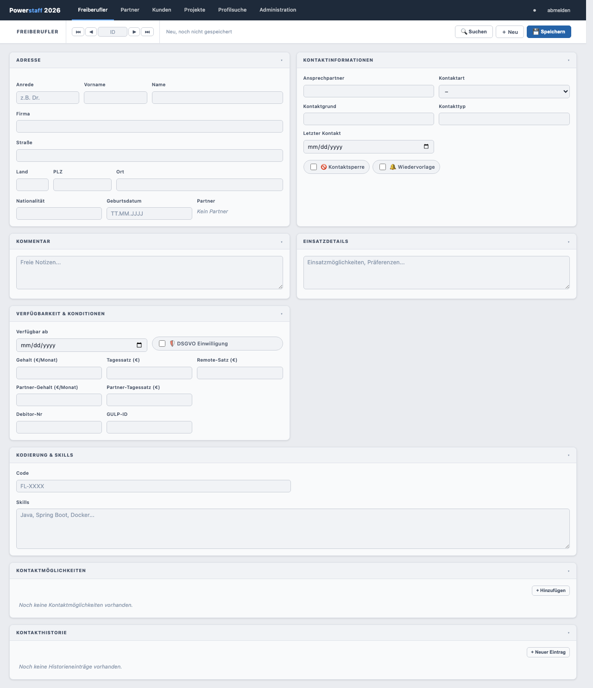
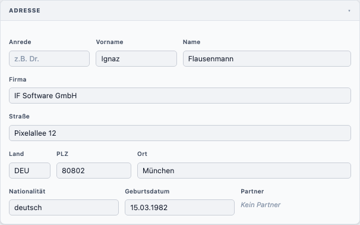
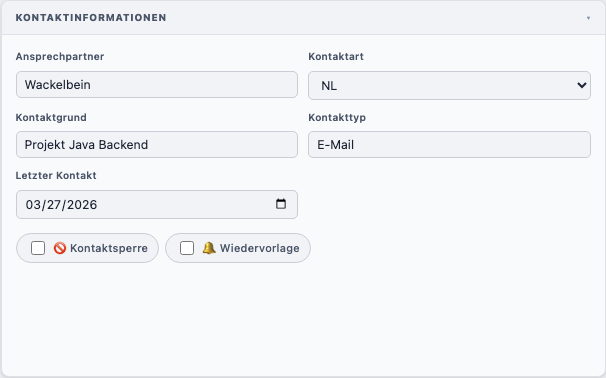
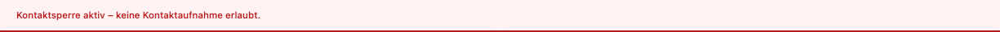
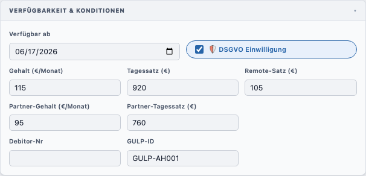
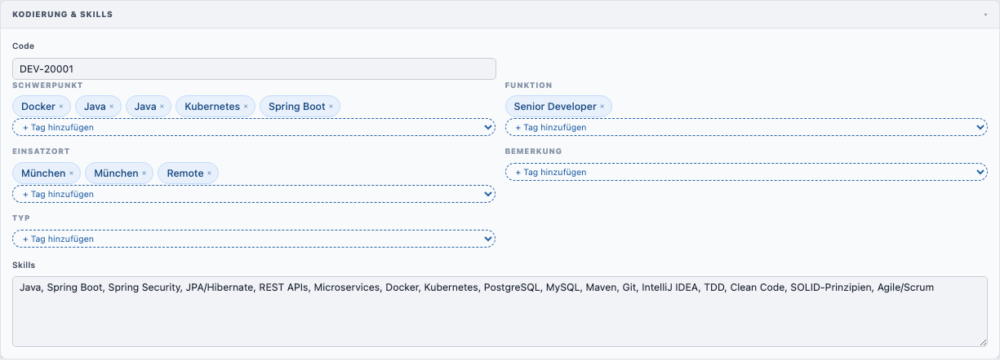
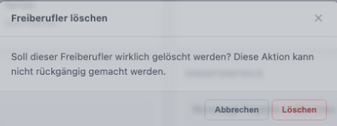
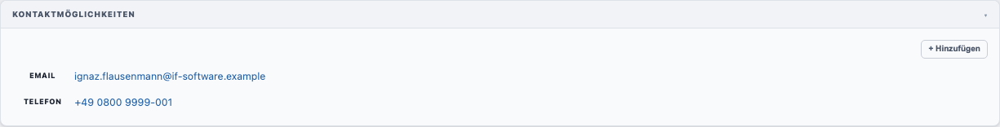
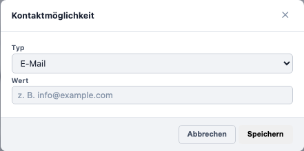

# Freiberufler anlegen

## Neuen Freiberufler erstellen

1. Klicken Sie in der Navigation auf **Freiberufler**
2. Klicken Sie in der Toolbar auf **＋ Neu**

Sie sehen das leere Freiberufler-Formular.

---

## Felder ausfüllen

### Adresse

| Feld             | Pflicht | Beschreibung                                                                        |
|------------------|---------|-------------------------------------------------------------------------------------|
| **Anrede**       | Nein    | Titel, z. B. *Dr.*                                                                  |
| **Vorname**      | Nein    | Vorname des Freiberuflers                                                           |
| **Name**         | **Ja**  | Nachname (Pflichtfeld)                                                              |
| **Firma**        | Nein    | Firmenname                                                                          |
| **Straße**       | Nein    | Straße und Hausnummer                                                               |
| **Land**         | Nein    | Länderkürzel, max. 3 Zeichen                                                        |
| **PLZ**          | Nein    | Postleitzahl, max. 5 Zeichen                                                        |
| **Ort**          | Nein    | Wohnort                                                                             |
| **Nationalität** | Nein    | Nationalität                                                                        |
| **Geburtsdatum** | Nein    | Format: TT.MM.JJJJ                                                                  |
| **Partner**      | Nein    | Anzeige des zugeordneten Partners (nur lesbar, Zuordnung über das Partner-Formular) |

### Kontaktinformationen

| Feld                 | Pflicht | Beschreibung                                            |
|----------------------|---------|---------------------------------------------------------|
| **Ansprechpartner**  | Nein    | Interne Kontaktperson                                   |
| **Kontaktart**       | **Ja**  | Art der Kontaktbeziehung: *NL, NL1, NL2, X, NO, LL*     |
| **Kontaktgrund**     | Nein    | Grund der Kontaktaufnahme                               |
| **Kontakttyp**       | Nein    | Klassifizierung des Kontakts                            |
| **Letzter Kontakt**  | Nein    | Datum des letzten Kontakts                              |
| **🚫 Kontaktsperre** | Nein    | Wenn aktiv: roter Banner, Kontaktaufnahme nicht erlaubt |
| **🔔 Wiedervorlage** | Nein    | Markiert den Freiberufler zur erneuten Kontaktaufnahme  |

Ist die Kontaktsperre aktiv, erscheint oben im Formular ein roter Warnbanner:

### Kommentar / Einsatzdetails

Freie Textfelder für interne Notizen und Einsatzmöglichkeiten.

### Verfügbarkeit & Konditionen

| Feld                                   | Beschreibung                      |
|----------------------------------------|-----------------------------------|
| **Verfügbar ab**                       | Datum der nächsten Verfügbarkeit  |
| **🛡 DSGVO Einwilligung**              | Datenschutzeinwilligung vorhanden |
| **Gehalt (€/Monat)**                   | Gehaltsvorstellung                |
| **Tagessatz (€)**                      | Gewünschter Tagessatz             |
| **Remote-Satz (€)**                    | Tagessatz bei Remote-Einsatz      |
| **Partner-Gehalt / Partner-Tagessatz** | Konditionen über Partner          |
| **Debitor-Nr**                         | Interne Debitorennummer           |
| **GULP-ID**                            | ID auf der GULP-Plattform         |

### Kodierung & Skills

| Feld       | Beschreibung                                                             |
|------------|--------------------------------------------------------------------------|
| **Code**   | Eindeutiger interner Code, Format: *FL-XXXX*                             |
| **Tags**   | Kategorisierte Schlagworte (werden nach dem ersten Speichern editierbar) |
| **Skills** | Freitext-Beschreibung der Fachkenntnisse                                 |

---

## Speichern

Klicken Sie auf **💾 Speichern**. Nach erfolgreichem Speichern erscheint kurz der Banner:

> **Hinweis:** Das Code-Feld muss eindeutig sein. Wenn der Code bereits vergeben ist,
> erscheint die Warnung: *„Dieser Code wird bereits von einem anderen Freiberufler verwendet."*

---

## Freiberufler löschen

1. Öffnen Sie den gewünschten Freiberufler
2. Klicken Sie auf **🗑 Löschen** in der Toolbar
3. Bestätigen Sie den Dialog mit **Löschen**

> **Hinweis:** Ein Freiberufler kann nicht gelöscht werden, wenn noch Projektpositionen
> zugeordnet sind. In diesem Fall erscheint eine Meldung mit Links zu den blockierenden Projekten.

---

## Kontaktmöglichkeiten verwalten

Im Abschnitt **Kontaktmöglichkeiten** können Sie Kontaktdaten hinterlegen:

Ein einzelner Kontakteintrag sieht so aus:

**Kontakt hinzufügen:**
1. Klicken Sie auf **+ Hinzufügen**
2. Wählen Sie den **Typ**: *E-Mail, Telefon, Fax, Website, XING* oder *GULP*
3. Tragen Sie den **Wert** ein
4. Klicken Sie auf **Speichern**
5. Klicken Sie anschließend auf **💾 Speichern** im Formular

