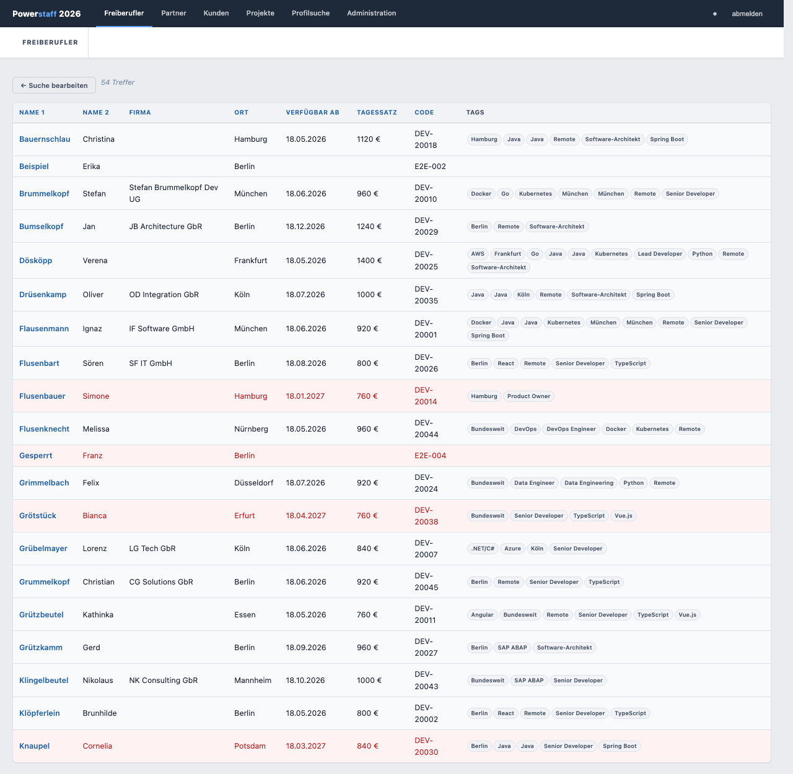
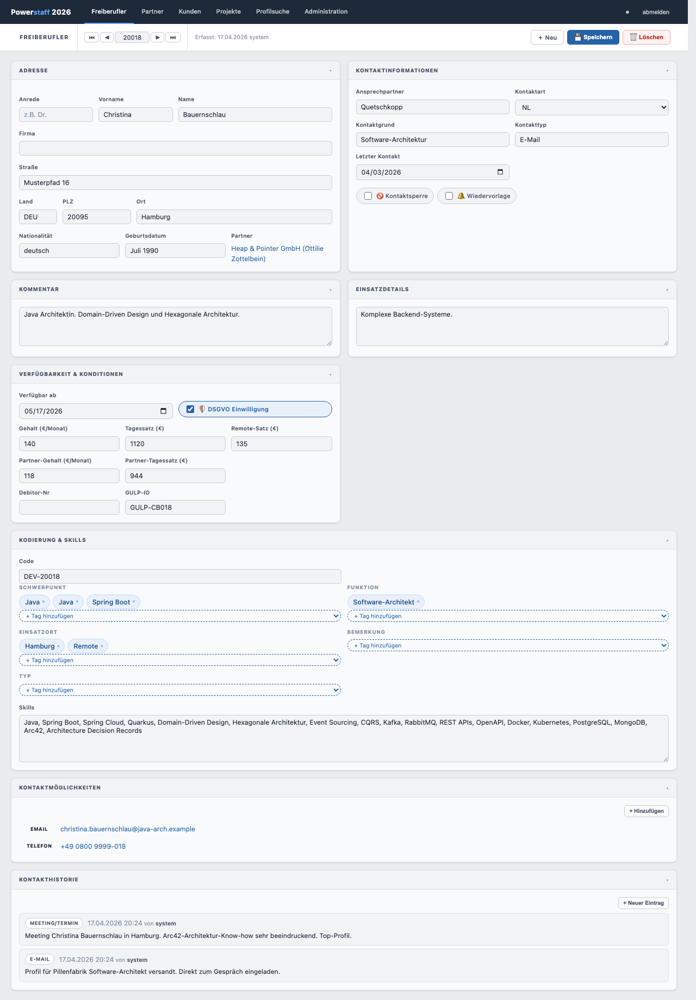

# Freiberufler suchen

## Suche starten

1. Klicken Sie in der Navigation auf **Freiberufler** (oder **＋ Neu** in der Toolbar)
2. Füllen Sie beliebig viele Felder als Suchkriterien aus
3. Klicken Sie auf **🔍 Suchen**

Alle Felder des Formulars können als Filterkriterien verwendet werden (Query by Example).
Lassen Sie alle Felder leer, um alle Freiberufler anzuzeigen.

---

## Ergebnistabelle

Die Treffer werden in einer Tabelle angezeigt:

| Spalte | Inhalt |
|--------|--------|
| **Name 1** | Nachname |
| **Name 2** | Vorname |
| **Firma** | Firmenname |
| **Ort** | Wohnort |
| **Verfügbar ab** | Nächste Verfügbarkeit |
| **Tagessatz** | Gewünschter Tagessatz in € |
| **Code** | Eindeutiger interner Code |
| **Tags** | Zugeordnete Schlagworte |

Alle Spaltenüberschriften sind anklickbar und sortieren die Ergebnisse auf- oder absteigend.

Bei sehr langen Ergebnislisten werden weitere Datensätze automatisch nachgeladen (Infinite Scrolling).

---

## Datensatz öffnen

Klicken Sie auf eine Zeile, um den Freiberufler zu öffnen.

---

## Suche verfeinern

Klicken Sie auf **← Suche bearbeiten** (oberhalb der Ergebnistabelle), um zur Suchmaske
mit den vorherigen Kriterien zurückzukehren.

---

## Kontaktsperre in der Ergebnisliste

Freiberufler mit aktiver Kontaktsperre erscheinen in der Ergebnisliste **rot hinterlegt**.
Im geöffneten Formular erscheint zudem ein roter Banner: *„Kontaktsperre aktiv – keine Kontaktaufnahme erlaubt."*

---

## Tag-Filter

Klicken Sie auf ein Tag-Chip in der Ergebnisliste, um alle Freiberufler mit diesem Tag zu filtern.
