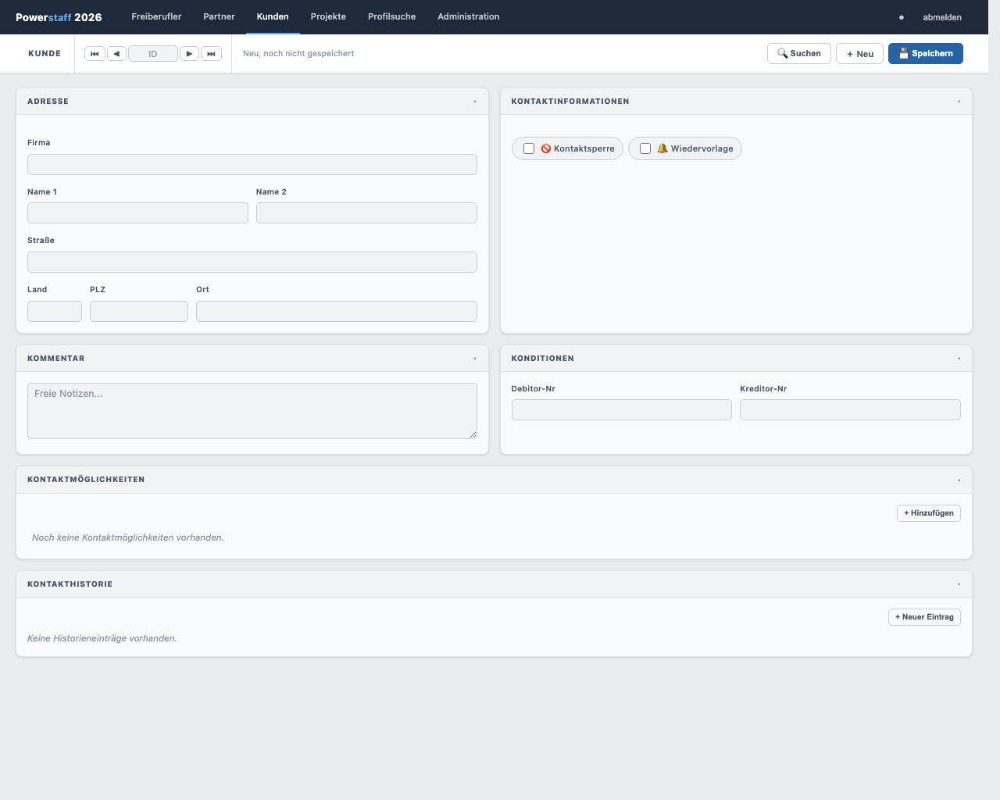
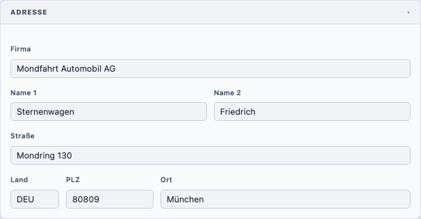
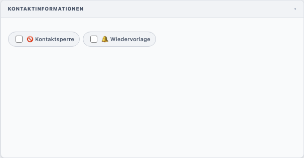
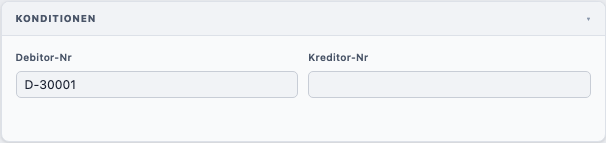
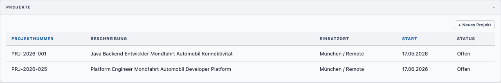
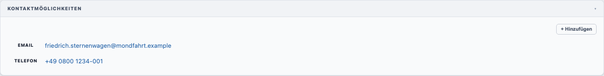
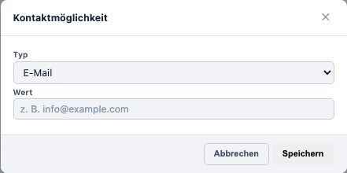

# Kunden anlegen

## Neuen Kunden erstellen

1. Klicken Sie in der Navigation auf **Kunden**
2. Klicken Sie in der Toolbar auf **＋ Neu**

---

## Felder ausfüllen

### Adresse

| Feld       | Pflicht | Beschreibung                 |
|------------|---------|------------------------------|
| **Firma**  | **Ja**  | Firmenname des Kunden        |
| **Name 1** | Nein    | Nachname Ansprechpartner     |
| **Name 2** | Nein    | Vorname Ansprechpartner      |
| **Straße** | Nein    | Straße und Hausnummer        |
| **Land**   | Nein    | Länderkürzel, max. 3 Zeichen |
| **PLZ**    | Nein    | Postleitzahl, max. 5 Zeichen |
| **Ort**    | Nein    | Ort                          |

### Kontaktinformationen

| Feld                 | Beschreibung                                            |
|----------------------|---------------------------------------------------------|
| **🚫 Kontaktsperre** | Wenn aktiv: roter Banner, Kontaktaufnahme nicht erlaubt |
| **🔔 Wiedervorlage** | Markiert den Kunden zur erneuten Kontaktaufnahme        |

Ist die Kontaktsperre aktiv, erscheint oben im Formular ein roter Warnbanner:

### Kommentar

Freies Textfeld für interne Notizen.

### Konditionen

---

## Speichern

Klicken Sie auf **💾 Speichern**.

---

## Zugeordnete Projekte

Bei bestehenden Kunden zeigt der Abschnitt **Projekte** alle zugeordneten Projekte als anklickbare Tabelle:

---

## Kontaktmöglichkeiten verwalten

Im Abschnitt **Kontaktmöglichkeiten** können Sie Kontaktdaten hinterlegen:

Ein einzelner Kontakteintrag:

Klicken Sie auf **+ Hinzufügen**:

---

## Kunden löschen

1. Öffnen Sie den gewünschten Kunden
2. Klicken Sie auf **🗑 Löschen** in der Toolbar
3. Bestätigen Sie den Dialog mit **Löschen**

> **Hinweis:** Ein Kunde kann nicht gelöscht werden, wenn noch Projekte zugeordnet sind.
