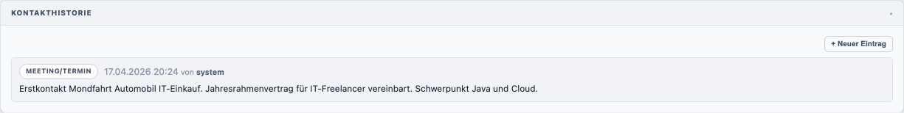
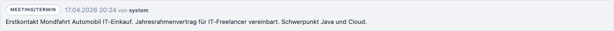
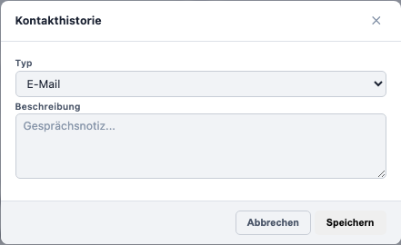

# Kontakthistorie (Kunden)

Die Kontakthistorie beim Kunden funktioniert identisch wie beim Freiberufler.

Ein einzelner Historieneintrag zeigt Typ-Badge, Zeitstempel und Beschreibungstext:

Klicken Sie auf **+ Neuer Eintrag**, um den Dialog zu öffnen:

Bitte lesen Sie für den vollständigen Workflow: [Kontakthistorie – Freiberufler](../freiberufler/kontakthistorie.md)
