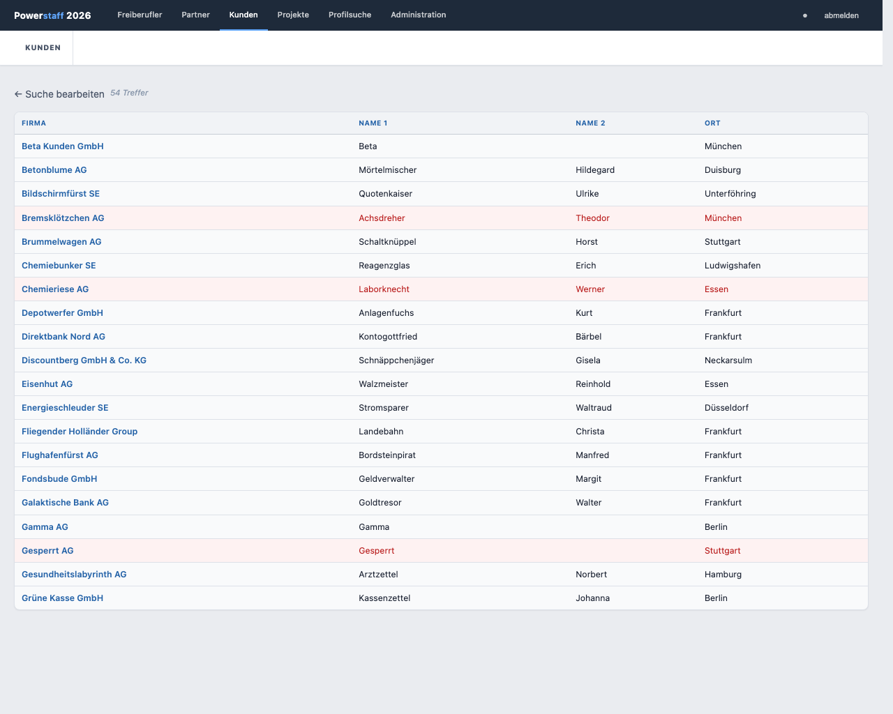
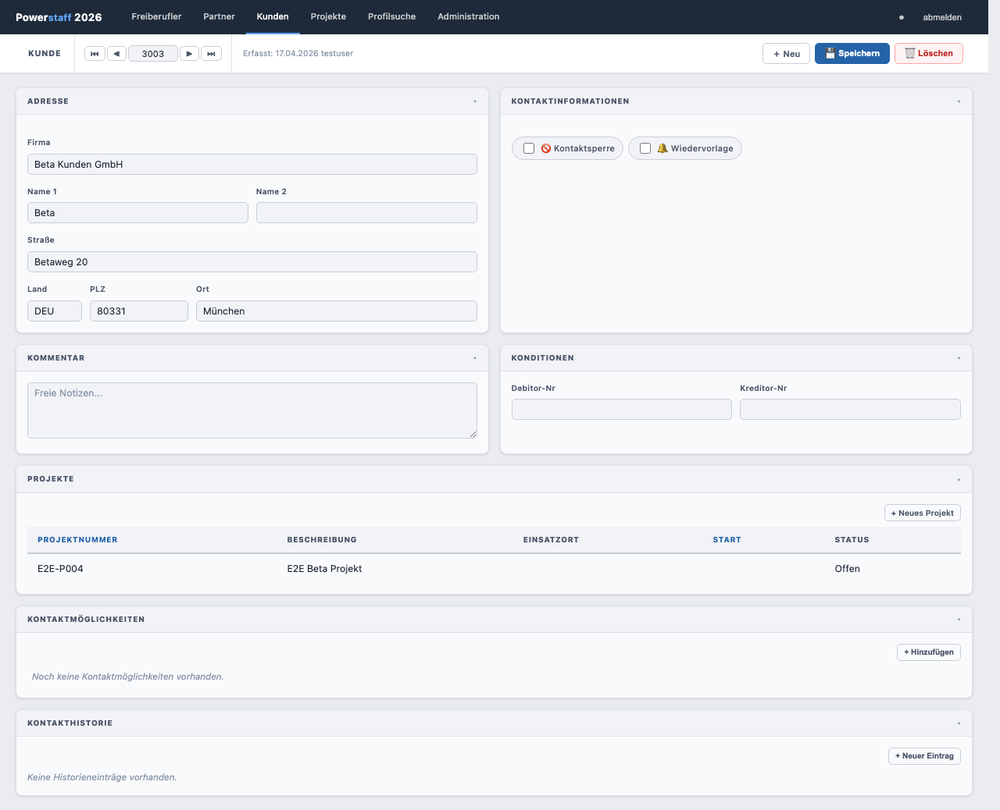

# Kunden suchen

## Suche starten

1. Klicken Sie in der Navigation auf **Kunden** (oder **＋ Neu** in der Toolbar)
2. Füllen Sie beliebig viele Felder als Suchkriterien aus
3. Klicken Sie auf **🔍 Suchen**

---

## Ergebnistabelle

| Spalte | Inhalt |
|--------|--------|
| **Firma** | Firmenname |
| **Name 1** | Nachname Ansprechpartner |
| **Name 2** | Vorname Ansprechpartner |
| **Ort** | Standort |

Klicken Sie auf eine Zeile, um den Kunden zu öffnen.

---

## Kontaktsperre in der Ergebnisliste

Kunden mit aktiver Kontaktsperre erscheinen **rot hinterlegt**.
