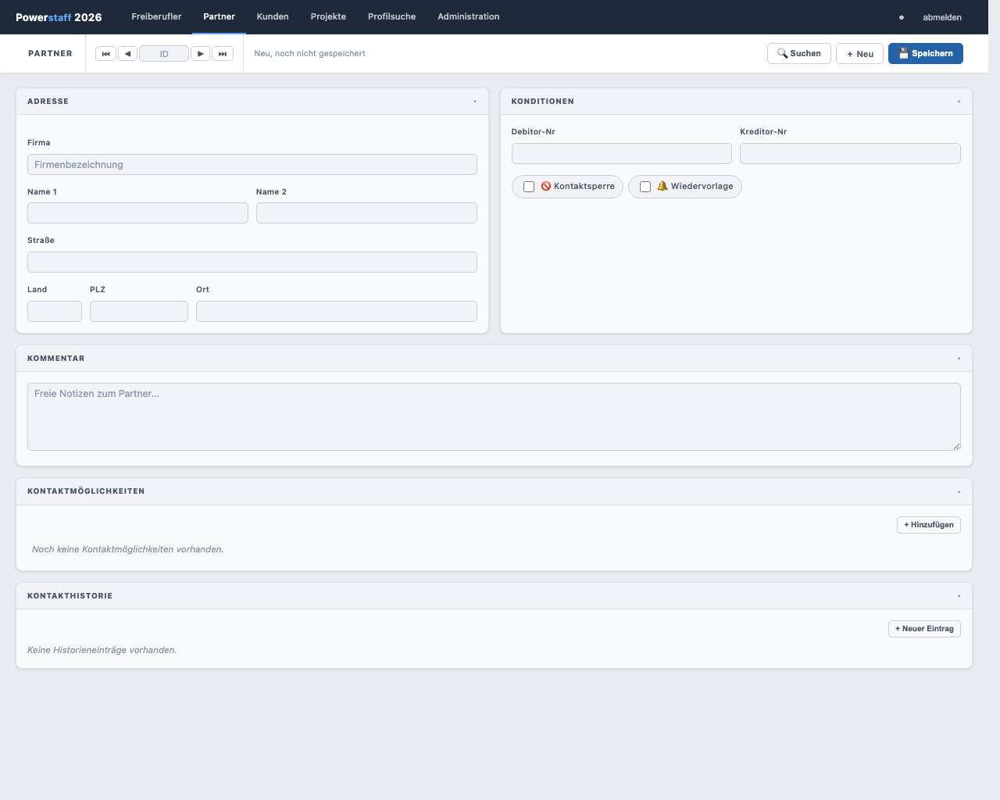

# Partner anlegen

## Neuen Partner erstellen

1. Klicken Sie in der Navigation auf **Partner**
2. Klicken Sie in der Toolbar auf **＋ Neu**

---

## Felder ausfüllen

### Adresse

| Feld | Pflicht | Beschreibung |
|------|---------|-------------|
| **Firma** | **Ja** | Firmenname der Vermittlungsagentur |
| **Name 1** | Nein | Nachname Ansprechpartner |
| **Name 2** | Nein | Vorname Ansprechpartner |
| **Straße** | Nein | Straße und Hausnummer |
| **Land** | Nein | Länderkürzel, max. 3 Zeichen |
| **PLZ** | Nein | Postleitzahl, max. 5 Zeichen |
| **Ort** | Nein | Ort |

### Konditionen

| Feld | Beschreibung |
|------|-------------|
| **Debitor-Nr** | Interne Debitorennummer |
| **Kreditor-Nr** | Interne Kreditorennummer |
| **🚫 Kontaktsperre** | Wenn aktiv: roter Banner, Kontaktaufnahme nicht erlaubt |
| **🔔 Wiedervorlage** | Markiert den Partner zur erneuten Kontaktaufnahme |

### Kommentar

Freies Textfeld für interne Notizen zum Partner.

---

## Speichern

Klicken Sie auf **💾 Speichern**.

---

## Zugeordnete Freiberufler

Bei bestehenden Partnern zeigt der Abschnitt **Zugeordnete Freiberufler** eine Liste aller
Freiberufler, die diesem Partner zugeordnet sind. Die Zuordnung erfolgt im Freiberufler-Formular
(Feld **Partner** in der Adresse).

---

## Partner löschen

1. Öffnen Sie den gewünschten Partner
2. Klicken Sie auf **🗑 Löschen** in der Toolbar
3. Bestätigen Sie den Dialog mit **Löschen**

> **Hinweis:** Ein Partner kann nicht gelöscht werden, wenn noch Projekte zugeordnet sind.
