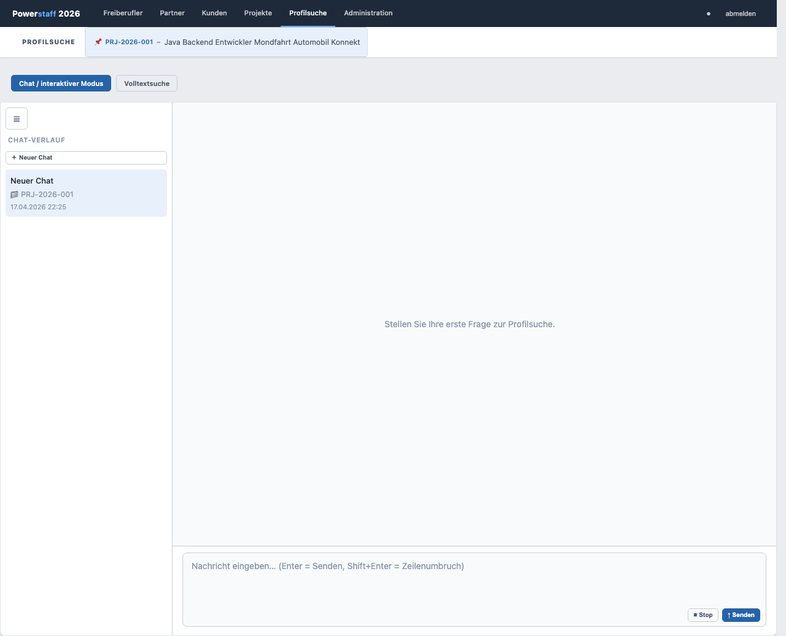

# KI-Konversationssuche (Chat-Modus)

Die KI-Profilsuche ermöglicht es, Freiberufler-Profile in natürlicher Sprache zu beschreiben.
Das System antwortet mit passenden Vorschlägen als anklickbare Links.

## Chat öffnen

1. Klicken Sie in der Navigation auf **Profilsuche**
2. Wählen Sie den Tab **Chat / interaktiver Modus**

---

## Neuen Chat starten

Klicken Sie auf **＋ Neuer Chat** in der linken Seitenleiste.

---

## Suchanfrage stellen

Beschreiben Sie in natürlicher Sprache, welches Profil Sie suchen:

> *„Ich suche einen Java-Entwickler mit Spring-Boot-Erfahrung, verfügbar ab Juli,
> Tagessatz bis 900 €, bevorzugt Remote."*

Der KI-Kontext wird bei **jeder Anfrage live aus der Datenbank** zusammengestellt.
Falls ein Projekt als gemerktes Projekt aktiv ist (📌 in der Toolbar), werden die
Projektdaten automatisch in den Kontext einbezogen.

---

## Ergebnisse nutzen

Die KI antwortet mit Freitext und anklickbaren Links zu passenden Freiberuflern.
Klicken Sie auf einen Link, um das Profil im Freiberufler-Formular zu öffnen.

Mit dem Button **← Zum Chat** im Freiberufler-Formular kehren Sie direkt in den Chat zurück.

---

## Chat-Verlauf

Die linke Seitenleiste zeigt alle bisherigen Chats mit Titel, Datum und ggf. zugehöriger
Projektnummer. Klicken Sie auf einen Eintrag, um den Chat zu öffnen.

Ein Chat kann über das **🗑**-Symbol gelöscht werden.

---

## Wechsel zur klassischen Suche

Klicken Sie auf den Tab **Volltextsuche**, um zur filtergestützten Suche zu wechseln.
