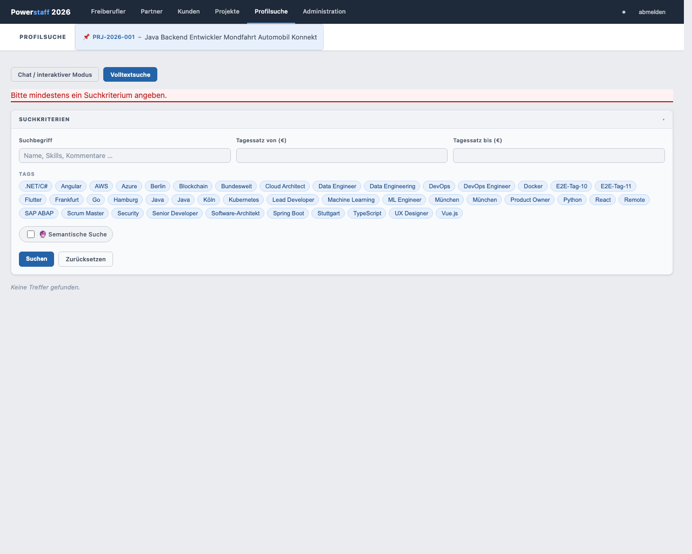
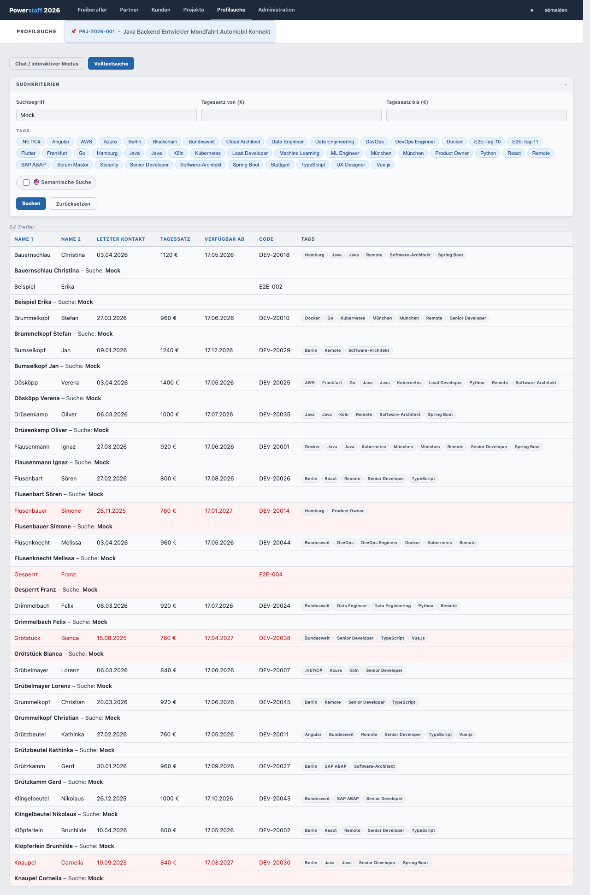

# Klassische Filtersuche (Volltextsuche)

Die klassische Suche ermöglicht die gezielte Filterung nach mehreren Kriterien gleichzeitig.

## Suche öffnen

1. Klicken Sie in der Navigation auf **Profilsuche**
2. Wählen Sie den Tab **Volltextsuche**

---

## Suchkriterien

| Feld | Beschreibung |
|------|-------------|
| **Suchbegriff** | Freitextsuche in Name, Skills, Kommentaren |
| **Tagessatz von (€)** | Mindest-Tagessatz (Schritte: 50 €) |
| **Tagessatz bis (€)** | Maximal-Tagessatz (Schritte: 50 €) |
| **Tags** | Klicken Sie auf Tag-Chips, um nach Skills zu filtern (Mehrfachauswahl möglich) |
| **Verfügbar ab** | Nur Freiberufler, die ab diesem Datum verfügbar sind |

---

## Suche starten

Klicken Sie auf **🔍 Suchen** oder drücken Sie Enter.

---

## Ergebnisliste

Die Treffer werden paginiert angezeigt (sortierbar nach verschiedenen Spalten).
Bei sehr langen Ergebnislisten werden weitere Datensätze automatisch nachgeladen.

Klicken Sie auf einen Freiberufler, um sein Profil zu öffnen.

Mit dem Button **← Zur Profilsuche** im Freiberufler-Formular kehren Sie direkt zur
Ergebnisliste zurück.

---

## Kontaktsperre in der Ergebnisliste

Freiberufler mit aktiver Kontaktsperre erscheinen **rot hinterlegt**.

---

## Wechsel zum Chat-Modus

Klicken Sie auf den Tab **Chat / interaktiver Modus**, um zur KI-Konversationssuche zu wechseln.
