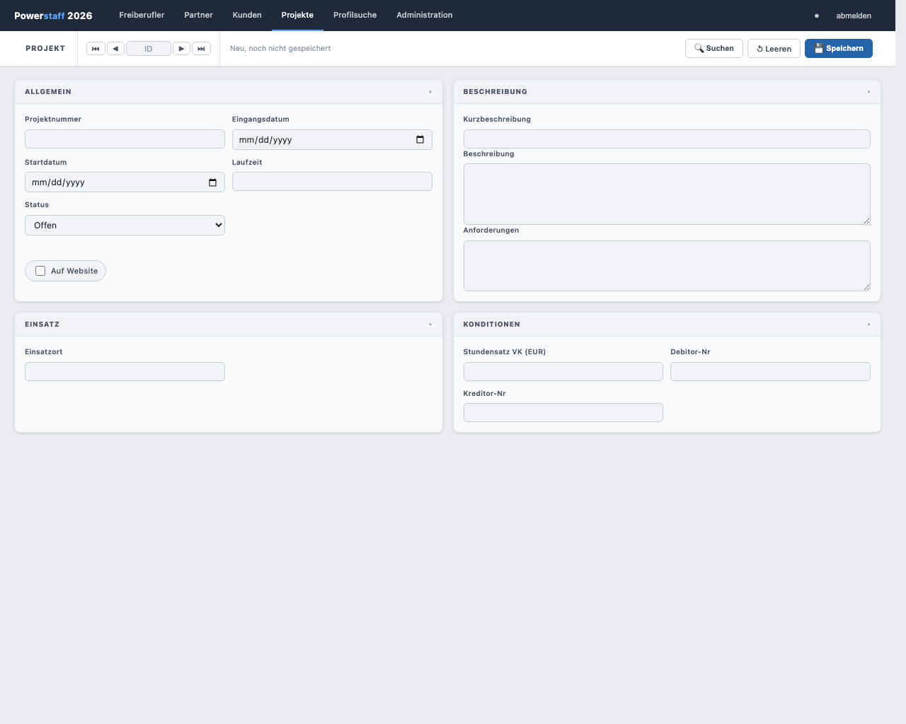
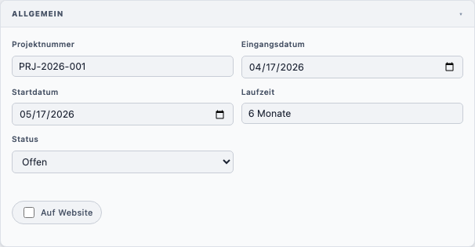
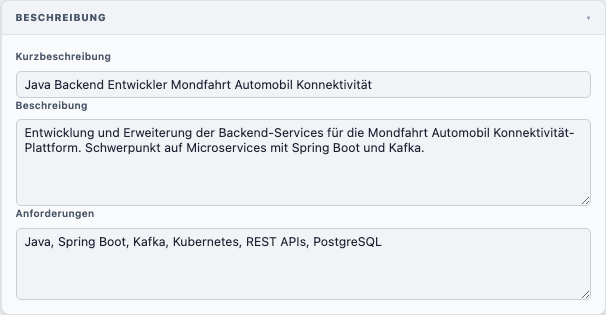
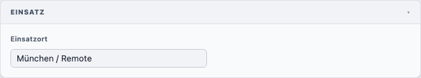
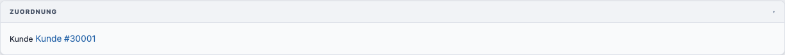
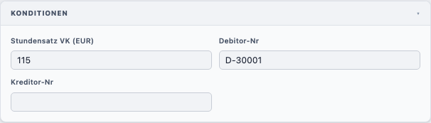
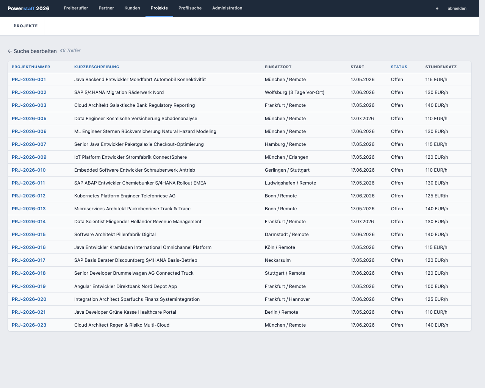
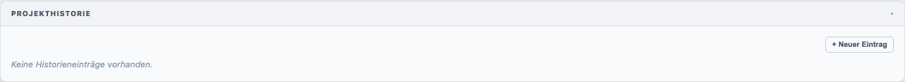
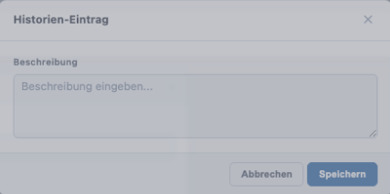

# Projekt anlegen

## Neues Projekt erstellen

1. Klicken Sie in der Navigation auf **Projekte**
2. Klicken Sie in der Toolbar auf **↺ Leeren** (leert das aktuelle Formular für Neuanlage)

---

## Felder ausfüllen

### Allgemein

| Feld              | Pflicht | Beschreibung                                        |
|-------------------|---------|-----------------------------------------------------|
| **Projektnummer** | **Ja**  | Eindeutige interne Nummer                           |
| **Eingangsdatum** | Nein    | Datum des Auftragseingangs                          |
| **Startdatum**    | Nein    | Geplanter Projektstart                              |
| **Laufzeit**      | Nein    | Geplante Projektlaufzeit                            |
| **Status**        | Nein    | *Offen / Verloren / Canceled / Besetzt / Search zu* |
| **Auf Website**   | Nein    | Projekt auf der Website veröffentlichen             |

### Beschreibung

| Feld                 | Pflicht | Beschreibung                                               |
|----------------------|---------|------------------------------------------------------------|
| **Kurzbeschreibung** | **Ja**  | Kurze Projektbeschreibung (erscheint in der Ergebnisliste) |
| **Beschreibung**     | Nein    | Ausführliche Projektbeschreibung                           |
| **Anforderungen**    | Nein    | Gefragte Skills und Anforderungen                          |

### Einsatz

| Feld           | Beschreibung                 |
|----------------|------------------------------|
| **Einsatzort** | Arbeitsort des Freiberuflers |

### Zuordnung

Beim **ersten Speichern** können Kunde und/oder Partner verknüpft werden.
Danach sind diese Felder schreibgeschützt und werden als Links angezeigt.

### Konditionen

| Feld                     | Beschreibung             |
|--------------------------|--------------------------|
| **Stundensatz VK (EUR)** | Verkaufs-Stundensatz     |
| **Debitor-Nr**           | Interne Debitorennummer  |
| **Kreditor-Nr**          | Interne Kreditorennummer |

---

## Speichern

Klicken Sie auf **💾 Speichern**. Nach dem ersten Speichern erscheint der Abschnitt
**Freiberufler** (Positionen) und die Kontakthistorie.

---

## Projekt suchen

1. Füllen Sie beliebige Felder als Suchkriterien aus
2. Klicken Sie auf **🔍 Suchen**

### Ergebnistabelle

| Spalte               | Inhalt                        |
|----------------------|-------------------------------|
| **Projektnummer**    | Interne Nummer                |
| **Kurzbeschreibung** | Kurze Beschreibung            |
| **Einsatzort**       | Arbeitsort                    |
| **Startdatum**       | Geplanter Start               |
| **Status**           | Projektstatus als Text        |
| **Stundensatz VK**   | Verkaufs-Stundensatz in EUR/h |

---

## Projekthistorie

Nach dem ersten Speichern steht die **Projekthistorie** zur Verfügung:

Klicken Sie auf **+ Neuer Eintrag**, um eine Notiz zu hinterlegen:

---

## Projekt löschen

1. Öffnen Sie das gewünschte Projekt
2. Klicken Sie auf **🗑 Löschen** in der Toolbar
3. Bestätigen Sie den Dialog

> **Hinweis:** Ein Projekt kann nicht gelöscht werden, wenn noch Positionen besetzt sind.
