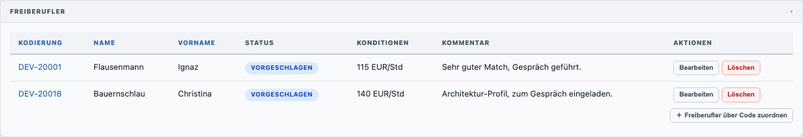
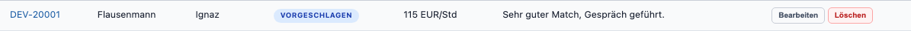

# Projektpositionen verwalten

Die **Freiberufler**-Tabelle im Projekt zeigt alle zugeordneten Positionen und deren Status.

Eine einzelne Positions-Zeile mit Status-Badge, Konditionen und Aktionsbuttons:

## Positionstabelle

| Spalte          | Inhalt                                                                                           |
|-----------------|--------------------------------------------------------------------------------------------------|
| **Kodierung**   | Code des Freiberuflers (anklickbar → öffnet Freiberufler-Formular)                               |
| **Name**        | Nachname                                                                                         |
| **Vorname**     | Vorname                                                                                          |
| **Status**      | Farbiger Status-Badge (konfigurierbar in [Stammdaten → Positionsstatus](../admin/stammdaten.md)) |
| **Konditionen** | Vereinbarte Konditionen                                                                          |
| **Kommentar**   | Interne Notiz zur Position                                                                       |
| **Aktionen**    | Bearbeiten / Löschen                                                                             |

---

## Position bearbeiten

1. Klicken Sie auf **Bearbeiten** in der Zeile der entsprechenden Position
2. Im Dialog können Sie ändern:
   - **Status** – wählen Sie aus den konfigurierten Positionsstatus
   - **Konditionen** – vereinbarte Konditionen
   - **Kommentar** – interne Notiz
3. Klicken Sie auf **Speichern** im Dialog

---

## Position löschen

1. Klicken Sie auf **Löschen** in der Zeile der entsprechenden Position
2. Bestätigen Sie den Dialog mit **Löschen**

> Ein **Abbrechen**-Klick schließt den Dialog ohne Änderung.

---

## Positionsstatus konfigurieren

Die verfügbaren Status und ihre Farben werden vom Administrator gepflegt:
[Administration → Positionsstatus](../admin/stammdaten.md)
